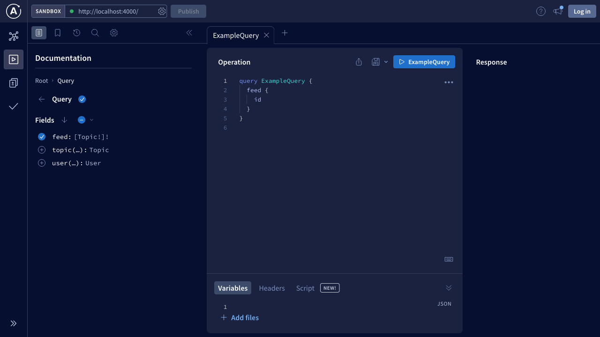
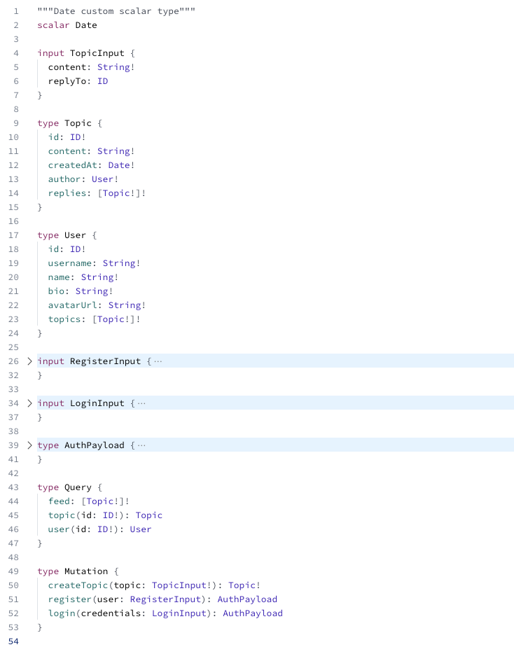
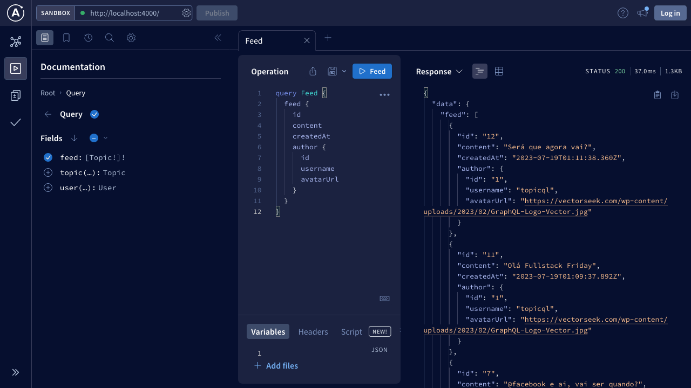
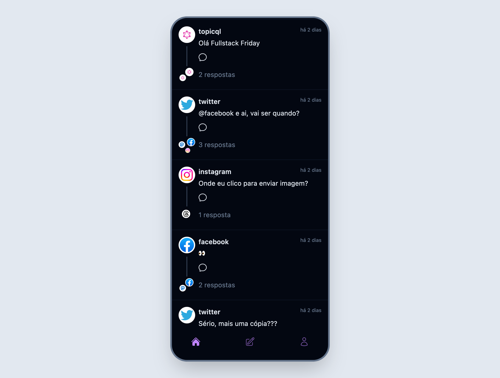
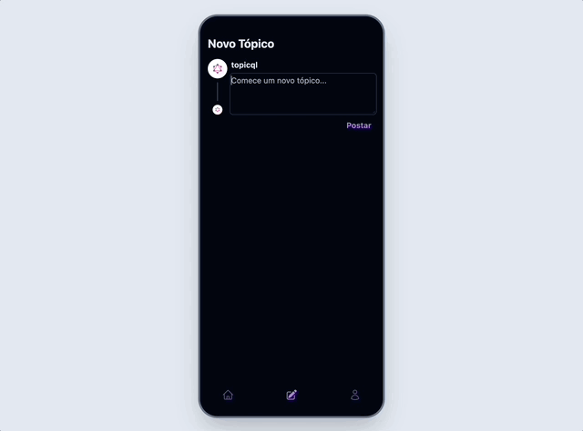

# TopicQL - Um estudo de GraphQL

## Introdução

O TopicQL é um projeto de exemplo que demonstra o uso do GraphQL no frontend com o framework Vue e no backend com Node.js e TypeScript. Este tutorial fornecerá instruções passo a passo sobre como configurar e executar o projeto, bem como como utilizar o GraphQL para se conectar à API.

## Rodando a aplicação

Antes de iniciar a aplicação, é necessário instalar as dependências. Certifique-se de estar na raiz do projeto e execute o seguinte comando no terminal:

```sh
npm install
```

### Iniciando a API

O projeto inclui uma API GraphQL de exemplo implementada em Node.js/TypeScript. Para iniciar a API, siga os seguintes passos:

1. Navegue até a pasta `apps/backend`:

   ```sh
   cd apps/backend
   ```

1. Prepare o banco de dados SQLite e inicie o servidor:

   ```sh
   npm run db:prepare
   npm run dev
   ```

   Agora, o backend estará ouvindo as requisições em [http://localhost:4000](http://localhost:4000) e um banco de dados SQLite terá sido criado.

### Iniciando o Frontend

Para iniciar o frontend, abra um novo terminal e siga os seguintes passos:

1. Navegue até a pasta `app/web`:

   ```sh
   cd apps/web
   ```

1. Inicie o servidor:

   ```sh
   npm run dev
   ```

   Você deverá ver algo como:

   ```txt
   VITE v4.3.9  ready in 243 ms

   ➜  Local:   http://localhost:5173/
   ➜  Network: use --host to expose
   ➜  press h to show help
   ```

   Com isso, o servidor de desenvolvimento do Vue irá compilar o código e disponibilizará a aplicação em [http://localhost:5173/](http://localhost:5173/) (a porta pode variar de acordo com a disponibilidade).

## Explorando a API GraphQL

Ao abrir o link [http://localhost:4000](http://localhost:4000), somos direcionados ao Apollo Sandbox, onde podemos explorar nossa API e desenvolver e testar nossas queries:



Se clicarmos no primeiro ícone no canto esquerdo, podemos ver a definição do Schema com os tipos, queries e mutations:



Nossa API disponibiliza três queries:

- `feed`: com ela podemos buscar uma lista de tópicos
- `topic(id: ID!)`: busca um tópico pelo seu id
- `user(id: ID!)`: busca um usuário pelo id

Se quisermos montar o feed para o nosso app, poderíamos usar o `feed` e selecionar os dados desejados. Volte para o `Explorer` e insira a seguinte query no editor:

```gql
query Feed {
  feed {
    id
    content
    createdAt
    author {
      id
      username
      avatarUrl
    }
  }
}
```

Em seguida, clique no botão "▶️ Feed". Você deve ver o resultado da query aparecer na direita:



Sinta-se à vontade para adicionar ou remover campos da query e ver como isso é refletido na resposta.

## Executando a primeira Query no frontend

Se você trabalhar em algum projeto que usa GraphQL, provavelmente você vai ter que usar alguma biblioteca que cuida da comunicação com o backend. Chamamos essas libs de `Clients`. Temos algumas opções, como vamos ver daqui a pouco, mas antes de usar um client, vamos fazer uma query manualmente para ver que não existe nenhuma mágica ou tecnologia diferente por trás.

No nosso projeto, vamos abrir o arquivo `apps/web/src/modules/feed/pages/FeedPage.vue` e começar a testar. O GraphQL, por trás dos panos, usa requisições POST, então podemos reproduzir uma das queries que vimos no sandbox usando a função `fetch` do navegador. Vamos adicionar o seguinte código no script do nosso componente:

```ts
import { ref } from 'vue';

import TopicList from '@/components/TopicList.vue';
import LoadingIndicator from '@/components/LoadingIndicator.vue';

const topics = ref<any>();
const loading = ref(true);

fetch('http://localhost:4000/', {
  headers: {
    'content-type': 'application/json',
  },
  body: JSON.stringify({
    query: `#graphql
    query Feed {
      feed {
        id
        content
        createdAt
        author {
          id
          username
          avatarUrl
        }
      }
    }
    `,
  }),
  method: 'POST',
})
  .then((response) => response.json())
  .then((json) => {
    topics.value = json.data.feed;
    loading.value = false;
  });
```

Para visualizar os dados, podemos adicionar os seguintes elementos no nosso template:

```html
<template v-if="loading">
  <LoadingIndicator></LoadingIndicator>
</template>
<template v-else-if="topics">
  <TopicList :topics="topics"></TopicList>
</template>
```

O código anterior usa o `fetch` para fazer um `POST` na API, passando no corpo da requisição um objeto com o campo `query` que é a string usada como exemplo no Sandbox. O `JSON.stringify` e o comentário `#graphql` são apenas conveniências para simplificar a escrita do payload e fazer com que o editor de texto destaque a string como se fosse GraphQL.

Caso tenha alguma dúvida, o código completo pode ser encontrado [aqui](https://github.com/allanmaral/topicql/blob/e0717056a7aa75d778182737da3c662ad051a2d3/apps/web/src/modules/feed/pages/FeedPage.vue).

## Clients GraphQL

Como vimos no exemplo anterior, não precisamos de nenhuma biblioteca para usar o GraphQL, afinal, ele é uma linguagem agnóstica de plataforma, o que significa que podemos usá-la em qualquer framework frontend. Mas lidar com todas as peculiaridades do GraphQL pode ser um pouco trabalhoso, principalmente quando entramos em casos de uso mais avançados, como deduplicação de requisições e cache. Por isso, é bem comum usarmos alguma biblioteca para abstrair esses detalhes. Abaixo estão algumas opções para clientes GraphQL em diferentes frameworks:

- Angular: [apollo-angular](https://the-guild.dev/graphql/apollo-angular/docs)
- React: [apollo](https://www.apollographql.com/docs/react/), [relay](https://www.apollographql.com/docs/react/), [urql](https://formidable.com/open-source/urql/docs/basics/react-preact/)
- Svelte: [@urql/svelte](https://formidable.com/open-source/urql/docs/basics/svelte/)
- Vue 3: [@urql/vue](https://formidable.com/open-source/urql/docs/basics/vue/)
- Vue 2: [vue-apollo](https://apollo.vuejs.org/guide/installation.html#manual-installation)

### URQL e Vue

Nesse tutorial, vamos utilizar o URQL como client do GraphQL para simplificar as operações. Vamos usar o guia de instalação dos bindings para Vue como referência. Você pode encontrar o guia completo [aqui](https://formidable.com/open-source/urql/docs/basics/vue/).

O primeiro passo é instalar as dependências:

```sh
npm install @urql/vue graphql
```

Com as dependências instaladas, vamos criar uma instância do client e um plugin Vue. Crie o arquivo `apps/web/src/lib/graphql/client.ts` com o seguinte conteúdo:

```ts
import urql, { Client, cacheExchange, fetchExchange } from '@urql/vue';
import { App } from 'vue';

export const client = new Client({
  url: 'http://localhost:4000/',
  exchanges: [cacheExchange, fetchExchange],
});

export function graphql(app: App) {
  app.use(urql, client);
}
```

Aqui, criamos um client usando a classe `Client` do pacote `@urql/vue` e configuramos ele para apontar para a URL da nossa API. Em seguida, criamos uma função que funciona como um plugin do Vue e instala o URQL e provê nosso cliente para toda a aplicação.

Por fim, vamos instalar nosso plugin no arquivo `apps/web/src/main.ts`:

```diff
 import './assets/style/style.css';
+import { graphql } from './lib/graphql/client.ts';

 const app = createApp(App);

 ...

 app.use(router);
+app.use(graphql);

 app.mount('#app');
```

Com isso, já estamos prontos para usar o URQL na nossa aplicação.

## Atualizando a query com URQL

Agora que temos o URQL instalado, podemos substituir o código manual da nossa query GraphQL por meio do composable `useQuery`. O `useQuery` é uma funcionalidade do URQL que nos permite fazer consultas GraphQL no frontend de forma mais simples.

Primeiro, vamos importar as dependências necessárias e definir nossa query.

```ts
import { computed } from 'vue';
import { useQuery, gql } from '@urql/vue';
```

Agora, podemos usar o useQuery para fazer a consulta GraphQL:

```ts
const { data, fetching, error } = useQuery({
  query: gql`
    query Feed {
      feed {
        id
        content
        createdAt
        author {
          id
          username
          avatarUrl
        }
      }
    }
  `,
});
```

O `useQuery` é uma função que recebe um objeto de configuração contendo a query GraphQL. Passamos a query como uma string usando o `gql` do URQL, que permite destacar e formatar a query de forma mais legível.

O `useQuery` retorna um objeto que contém várias propriedades:

- `data`: Contém os dados retornados pela query após ela ser concluída. Esses dados podem ser acessados por meio de `data.value`.
- `fetching`: É uma flag booleana que indica se a requisição está em andamento (`true`) ou se já foi concluída (`false`). Isso pode ser usado para exibir um indicador de carregamento enquanto a requisição está sendo processada.
- `error`: Se houver algum erro durante a execução da query, ele será armazenado aqui. Caso contrário, será `null`.

Agora que temos os dados da consulta disponíveis em `data`, podemos usá-los no nosso template para exibir os tópicos na página. Para isso, criamos uma variável computada `topics` que extrai os tópicos do objeto `data`.

```ts
const topics = computed(() => data.value?.feed);
```

Com isso, podemos atualizar nosso template para usar os novos dados:

```html
<template v-if="fetching">
  <LoadingIndicator></LoadingIndicator>
</template>
<template v-else-if="error">
  <ErrorMessage />
</template>
<template v-else-if="topics">
  <TopicList :topics="topics"></TopicList>
</template>
```

Não se esqueça de importar o componente de mensagagem de erro:

```ts
import ErrorMessage from '@/components/ErrorMessage.vue';
```

O resultado dever ser alguma coisa assim:



Você pode ver todas as alterações [aqui](https://github.com/allanmaral/topicql/commit/5fb828babd071f14c355f3c20e6c59c01e87a554).

## Geração de Código

Agora que o nosso frontend está conectado à API GraphQL, podemos extrair informações do Schema do GraphQL e gerar definições de tipo automaticamente. Para isso, utilizaremos a ferramenta [`graphql-codegen`](https://the-guild.dev/graphql/codegen/docs/guides/react-vue), que escaneia o código por documentos GraphQL e extrai os tipos de acordo com o Schema.

### Instalação do graphql-codegen

Primeiro, vamos instalar as seguintes dependências:

```sh
npm install -D @graphql-codegen/cli @graphql-codegen/client-preset
```

Em seguida, crie um arquivo de configuração chamado `codegen.ts` na raiz do frontend. Esse arquivo indicará ao codegen que ele deve escanear todos os arquivos `.vue` e gerar definições de tipo na pasta `./src/gql`:

```ts
import type { CodegenConfig } from '@graphql-codegen/cli';

const config: CodegenConfig = {
  schema: 'http://localhost:4000',
  documents: ['src/**/*.vue'],
  ignoreNoDocuments: true, // for better experience with the watcher
  generates: {
    './src/gql/': {
      preset: 'client',
      config: {
        useTypeImports: true,
      },
    },
  },
};

export default config;
```

Para finalizar a configuração, adicione os seguintes comandos no `package.json` do frontend:

```json
"scripts": {
  "codegen": "graphql-codegen",
  "codegen:watch": "graphql-codegen --watch"
},
```

Agora você pode executar o seguinte comando para que o codegen gere automaticamente os tipos sempre que os arquivos forem alterados:

```sh
npm run codegen:watch
```

### Utilizando os tipos gerados no frontend

Com as definições de tipo geradas, podemos aproveitar ao máximo o GraphQL no frontend. Em vez de utilizar diretamente a tag `gql` do `@urql/vue`, troque-a pela função `graphql` gerada pelo codegen:

```diff
-const { data, fetching, error } = useQuery({
-  query: gql`
-    query Feed {
-      feed {
-        id
-        content
-        createdAt
-        author {
-          id
-          username
-          avatarUrl
-        }
-        replies {
-          author {
-            id
-            username
-            avatarUrl
-          }
-        }
-      }
-    }
-  `,
-});
+const feedQueryDocument = graphql(/* GraphQL */ `
+ query Feed {
+   feed {
+     id
+     content
+     createdAt
+     author {
+       id
+       username
+       avatarUrl
+     }
+     replies {
+       author {
+         id
+         username
+         avatarUrl
+       }
+     }
+   }
+ }
+`);
+const { data, fetching, error } = useQuery({
+  query: feedQueryDocument,
+});
```

Agora você pode utilizar as definições do GraphQL de forma automática no frontend. Utilizando o codegen, você economiza tempo e evita erros relacionados aos tipos.

## Criando uma Mutation

Já vimos como ler dados com o GraphQL, agora está na hora de criar alguma coisa! Vamos implementar a feature de criação de um novo tópico para aprender a fazer nossa primeira `Mutation`.

Antes de mexer no frontend, vamos abrir o Sandbox e escrever a Mutation:

```gql
mutation CreateTopic($topic: TopicInput!) {
  createTopic(topic: $topic) {
    id
    content
    createdAt
    author {
      id
-     username
-     avatarUrl
    }
  }
}
```

Nela, usamos o `$topic: TopicInput!` para definir que vamos passar os dados do novo tópico como variáveis na requisição.

Abra o arquivo `apps/web/src/modules/post/pages/CreateTopicPage.vue`, você deve ver que já temos o template e parte do script definidos.

Vamos adicionar o seguinte código:

```ts
import { graphql } from '@/gql';
import { useMutation } from '@urql/vue';

const createTopicMutationDocument = graphql(/* GraphQL */ `
  mutation CreateTopic($topic: TopicInput!) {
    createTopic(topic: $topic) {
      id
      content
      createdAt
      author {
        id
-       username
-       avatarUrl
      }
    }
  }
`);

const { executeMutation: createTopic } = useMutation(
  createTopicMutationDocument
);
```

Aqui, copiamos a mutation que foi feita no Sandbox e usamos o composable `useMutation` para criar um método `createTopic` que vai executar a mutation ao ser chamado.

Agora podemos editar nosso `handleSubmit` para executar o comando:

```ts
const loading = ref(false);
async function handleSubmit(content: string) {
  try {
    loading.value = true;
    createTopic({ topic: { content } });
    router.push('/');
  } catch (error) {
    console.error('Ops...', error);
  } finally {
    loading.value = false;
  }
}
```

Vale notar que, graças à geração de tipos automática, o editor já sabe que devemos passar um objeto com os dados do tópico como parâmetro do `createTopic`.

Ao testar a aplicação, vemos que ao clicar em "Postar", o método `handleSubmit` é chamado e um novo tópico é criado:



## Próximas features

Esse projeto tem mais algumas features para serem implementadas. Fique à vontade para explorar a API e treinar o que aprendeu. Se você se sentir perdido, pode encontrar a solução na branch `solution`.

## Referências e Links úteis

- [Página oficial do GraphQL](https://graphql.org/)
- [Documentação do URQL](https://formidable.com/open-source/urql/docs/)
- [How to GraphQL](https://www.howtographql.com/)
- [Introduction to GraphQL | GraphQL](https://graphql.org/learn/)
- [awesome-graphql](https://github.com/chentsulin/awesome-graphql)
